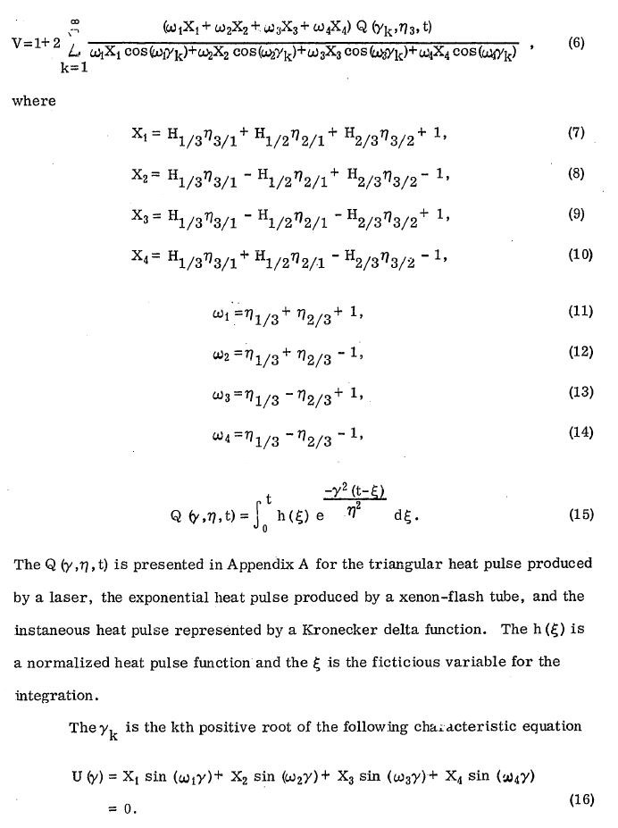
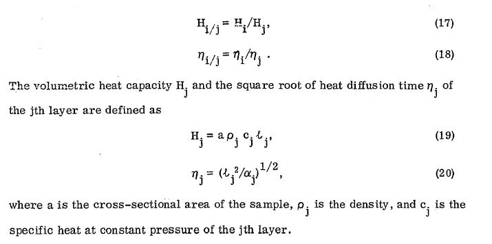

# threelayeredstructure

This is the program for calculating the the thermal conductivity in three layered structures.

## Build 

To build this project you need a compiler that support C++14 standard. To build simply run the following commands in bash:
	
	$ git clone https://github.com/AlexKiryushkin/threelayeredstructure
	$ cd threelayeredstructure
	$ mkdir build && cd build && cmake ..
	$ cmake --build ./

## Run

To run the program find the executable. By default the program reads parameter values from parameters.txt file in the project directory. You may assign values there. For unknown diffusivity alpha simply paste -1. If you want to go into interactive mode, just delete parameters.txt file and the porgram will ask to enter needed values.

## Algorithm

The program calculates the values according to the formulas from Lee, H.J., "Thermal Diffusivity in Layered and Dispersed Composites," Ph.D. Thesis, Purdue University, 1975:

